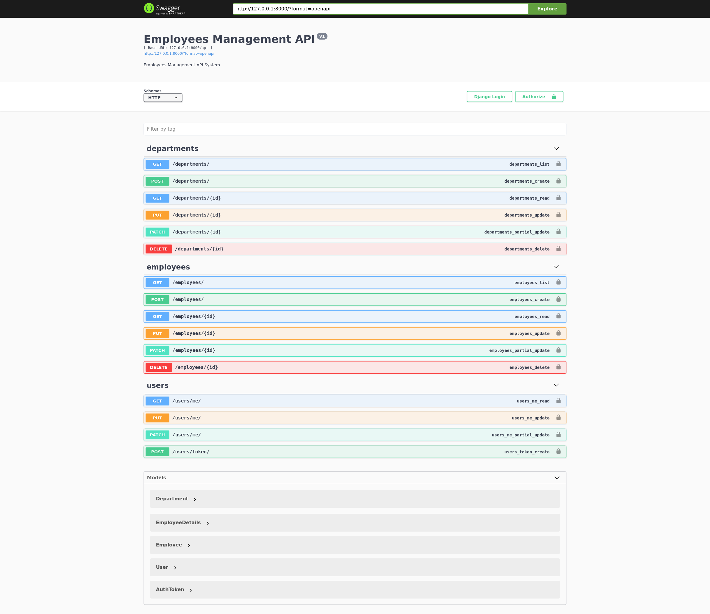

# Django Rest API


<p align="center">
  
</p>

<p align="center">
  <h3 align="center">django-rest-framework Employees management simple API </h3>
</p>

## in this project
- wrote test suites for endpoints
- wrote simple doc string for classes and functions
- followed Style Guide using flake8 tool
- generated swagger-ui docs
- dockerized app and database with docker-compose

## Getting started

To start project, run:
```
docker-compose up
```

To create superuser to test, run:
```
docker-compose run --rm app sh -c "python manage.py createsuperuser"
```

To run tests, run:
```
docker-compose run --rm app sh -c "python manage.py test && flake8"
```

The API will then be available at [http://127.0.0.1:8000](http://127.0.0.1:8000).
